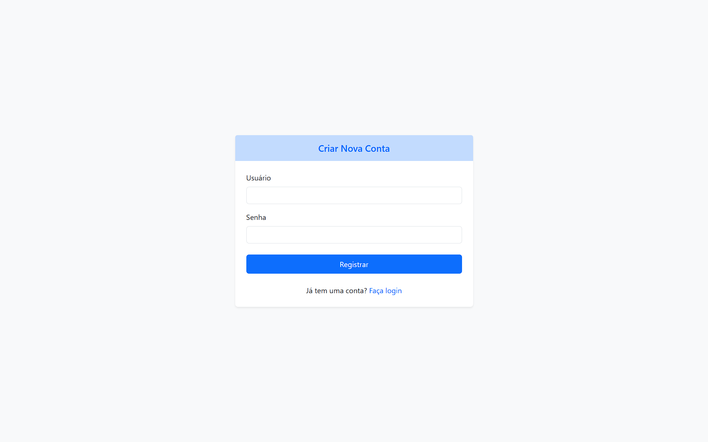
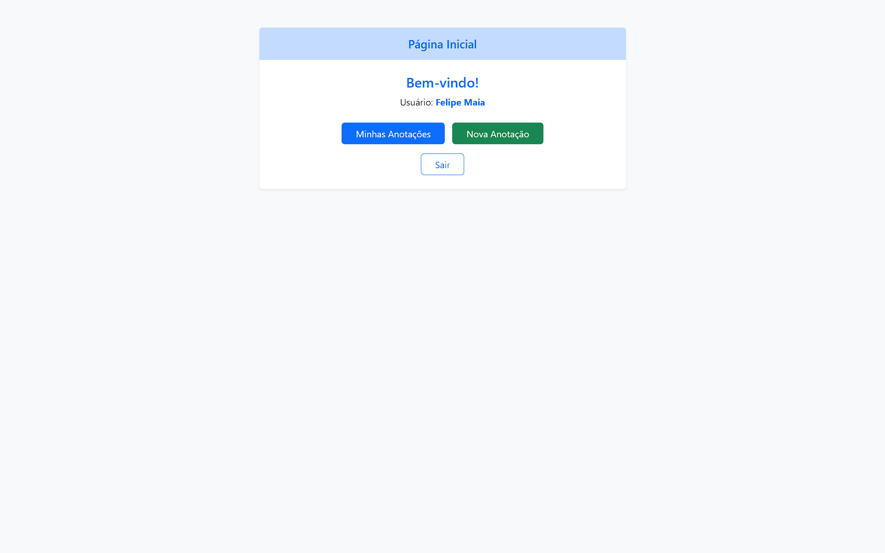

# 📝 Diário Pessoal - Flask

Um diário pessoal desenvolvido em **Flask**, com autenticação via **JWT**, criptografia de senhas e gerenciamento de anotações.
Permite que cada usuário crie, visualize, edite e delete suas próprias anotações, mantendo tudo seguro e privado.

---

## 📌 Funcionalidades

### Autenticação de Usuário

* Cadastro de novos usuários com senha criptografada.
* Login com geração de **JWT** para autenticação.

### Diário

* Criar novas anotações (título, conteúdo, data de criação).
* Listar todas as anotações do usuário logado.
* Visualizar, editar e deletar anotações específicas.
* Funcionalidades extras (opcional):

  * Marcar anotações como favoritas.
  * Pesquisar por título ou conteúdo.
  * Ordenar por data.

---

## 🗂 Estrutura do Projeto

```
projeto_diario/
│── app/
│   ├── __init__.py          # Inicialização do Flask app
│   ├── extensions.py        # Configuração de JWT, DB e bcrypt
│   ├── models/
│   │   ├── user.py          # Model do Usuário
│   │   └── note.py          # Model de Anotações
│   ├── routes/
│   │   ├── auth.py          # Rotas de autenticação
│   │   └── notes.py         # Rotas do diário
│   ├── utils/
│   │   └── security.py      # Funções auxiliares de hash e validação
│   └── config.py            # Configurações do projeto
│
├── create_db.py             # Script para criar o banco de dados
├── requirements.txt         # Dependências do projeto
└── run.py                   # Arquivo principal para rodar o projeto
```

---

## ⚙️ Tecnologias

* [Flask](https://flask.palletsprojects.com/) - Microframework web em Python.
* [Flask-JWT-Extended](https://flask-jwt-extended.readthedocs.io/) - Para autenticação via JWT.
* [Flask-SQLAlchemy](https://flask-sqlalchemy.palletsprojects.com/) - ORM para banco de dados.
* [bcrypt](https://pypi.org/project/bcrypt/) - Criptografia de senhas.
* Banco de dados: **SQLite** (simples e eficiente para projetos pequenos).

---

## 🚀 Como rodar o projeto

1. Clone o repositório:

```bash
git clone https://github.com/fel1pee3/projeto_diario.git
cd projeto_diario
```

2. Crie e ative um ambiente virtual:

```bash
python -m venv venv
# Windows
venv\Scripts\activate
# Linux / Mac
source venv/bin/activate
```

3. Instale as dependências:

```bash
pip install -r requirements.txt
```

4. Crie o banco de dados:

```bash
python create_db.py
```

5. Rode a aplicação:

```bash
python run.py
```

6. Acesse no navegador:

```
http://127.0.0.1:5000/
```

---

## 🔐 Segurança

* Senhas nunca são armazenadas em texto puro.
* Todas as rotas que acessam dados do usuário exigem **JWT válido**.
* JWT expira após tempo configurável para maior segurança.

---

## Pré-visualização
Prévia da aplicação:





---

## 📄 Licença

MIT License - Sinta-se livre para usar e modificar este projeto.
